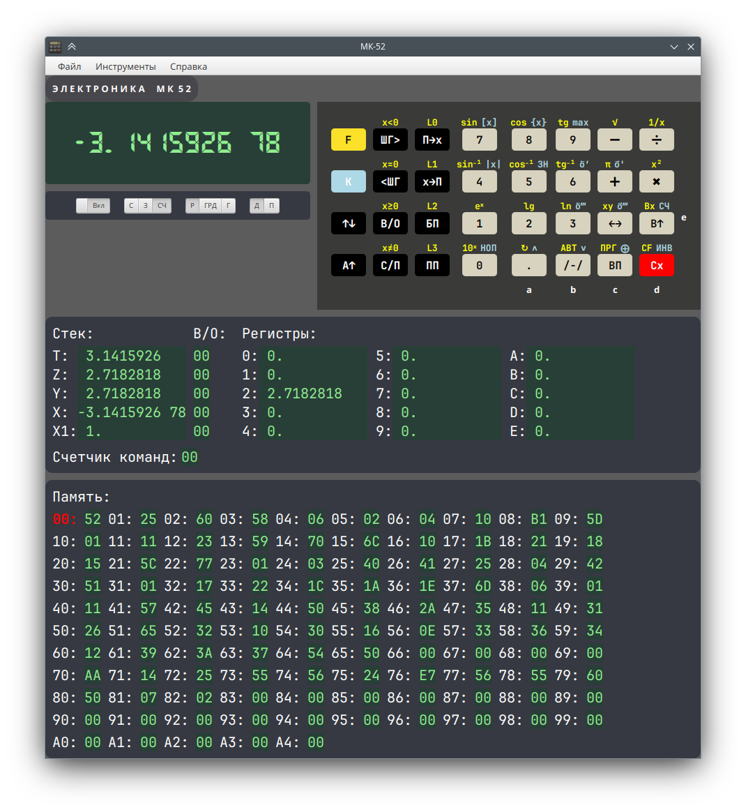

# МК-52


[](LICENSE)



Проект носит исключительно развлекательный характер. Основная цель - более или менее похоже воспроизвести внешнее
поведение микрокалькулятора МК-52 в соответствии с Руководством по эксплуатации (РЭ):
+ исполнение программ, не использующих недокументированные возможности (за исключением реализованных);
+ показ содержимого регистров, стека и стека возвратов.

[Сборка и запуск приложения](BUILD.md)

## Память и регистры

Реализованы следующие недокументированные особенности:
+ первая и вторая побочные ветви: 0-A4 &rarr; A5-B1 &rarr; B2-F9 &rarr; 0;
+ косвенная адресация регистров в случае двузначного адреса;
+ эффект "порчи" стека возвратов.

Дамп программной памяти можно сохранить в текстовый файл.

## Операции и команды

Реализованы все перечисленные в таблице 6 РЭ операции и команды.

Также реализованы некоторые недокументированные коды:

| Код | Клавиши | Описание         |
|-----|---------|------------------|
| 55  | К 1     | Эквивалент К НОП |
| 56  | К 2     | Эквивалент К НОП |

Вычисления с плавающей точкой выполняются на Java double, в связи с чем результат подавляющего большинства
функций отличается от оригинала в последних знаках. В частности, x<sup>y</sup> для 2 равно 4, а не 3.9999996 как в
реальном калькуляторе. Это различие невозможно устранить без полной эмуляции процессора, что не является целью проекта.

Релизовано мигание экрана при выполнении инструкций как в ручном, так и в программном режиме. Для имитации разного
времени исполнения инструкций используются приблизительные данные по https://erichware.com/sovkalk/grami/skorost.htm

## ППЗУ

Запись и чтение программ и регистров реализованы в соответствии с описанием из РЭ, включая перестановку ячеек при 
записи/чтении программ и логическое сложение с текущим содержимым ППЗУ.

В текущей реализации присутствуют следующие ограничения:

1. Операции с ППЗУ возможны только в режиме "Автоматическая работа".
2. При чтении данных не в том режиме, в котором они были записаны, результатом может быть неопределенное состояние
   памяти или регистров. Результат может не соответствовать поведению реального калькулятора.
3. На все операции с ППЗУ стоит одинаковая задержка, не имеющая ничего общего с прототипом.

Дамп ППЗУ сохраняется при выходе из приложения в файле ```$HOME/.mk52/eeprom.txt``` или 
```$HOME/.local/share/panteleyev.org/mk52/eeprom.txt```.

[Подробности реализации](docs/eeprom.md)

## Еггогология

Приблизительно реализовано поведение при возникновении чисел ярусов 1 и 2.

## Примеры программ

[Программы](docs/programs.md) сохранены в виде дампа памяти, которые можно загрузить через меню Файл&rarr;Загрузить...
