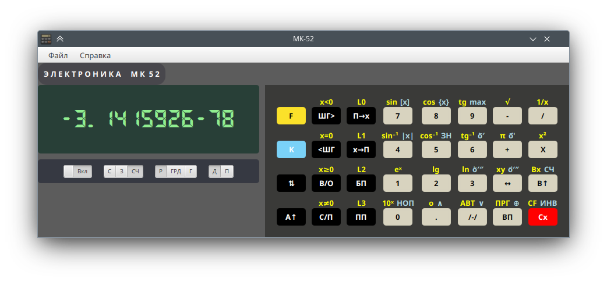

# Эмулятор микрокалькулятора МК-52


[](LICENSE)



Проект носит исключительно развлекательный характер и не преследует цели точно воспроизвести поведение прототипа.

В частности, арифметика с плавающей точкой выполняется на Java double. Поэтому x<sup>y</sup> для 2 здесь равно 4,
а не 3.9999996 как в оригинале.

## Память и регистры

Доступны убирающиеся панели для просмотра содержимого стека, регистров и памяти программ.

<details>

<summary>Подробности</summary>


</details>

## Время исполнения инструкций

Используются приблизительные данные по https://erichware.com/sovkalk/grami/skorost.htm

## ППЗУ

Внешнее поведение ППЗУ эмулируется приблизительно в соответствии с описанием со следующими особенностями:

1. Операции с ППЗУ возможны только в режиме "Автоматическая работа".
2. При чтении данных не в том режиме, в котором они были записаны, результатом может быть неопределенное состояние
   памяти или регистров. Результат в большинстве случаев не будет соответствовать поведению реального калькулятора.
3. При стирании не производится выравнивание начального адреса.

В целом, "корректное" использование ППЗУ должно внешне соответствовать описанию. Некорректное поведение будет
отличаться.

<details>
<summary>Детали</summary>

### Размещение регистров в ППЗУ

```
        Строка ППЗУ
Ячейка: [ 00 ][ 01 ][ 02 ][ 03 ][ 04 ][ 05 ][ 06 ][ 07 ][ 08 ][ 09 ][ 10 ][ 11 ][ 12 ][ 13 ]
7 - 0 мантисса
8 - знак мантиссы 9 (-) или 0 (+)
10-9 - порядок
11 - знак порядка 9 (-) или 0 (+)
```

Каждая ячейка содержит 4 бита.

Если экспонента отрицательная, то записывается значение 100-|экспонента|.


#### Примеры

3.1415926

```
0x6 0x2 0x9 0x5 0x1 0x4 0x1 0x3 0x0 0x0 0x0 0x0 0x0 0x0
```

-3.1415926e-87

```
0x6 0x2 0x9 0x5 0x1 0x4 0x1 0x3 0x9 0x3 0x1 0x9 0x0 0x0
```

3.1415926e87

```
0x6 0x2 0x9 0x5 0x1 0x4 0x1 0x3 0x0 0x7 0x8 0x0 0x0 0x0
```
</details>

Дамп ППЗУ хранится в файле ```$HOME/.mk52/eeprom.txt``` или ```$HOME/.local/share/panteleyev.org/mk52/eeprom.txt```

## Ссылки

1. https://mk-61.moy.su/memory.html