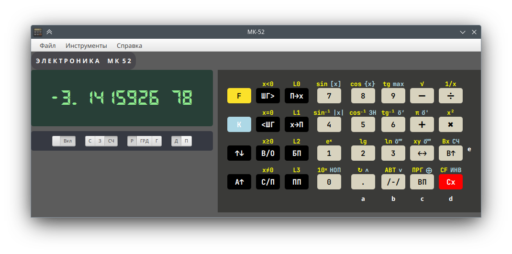

# Эмулятор микрокалькулятора МК-52

Проект носит исключительно развлекательный характер и не преследует цели точно воспроизвести поведение прототипа.

В частности, арифметика с плавающей точкой выполняется на Java double. Поэтому xy для 2 здесь равно 4,
а не 3.9999996 как в оригинале.

## Укороченный тест

См. Таблица I "Укороченный тест для контроля функционирования микрокалькулятора без периферийных устройств".

| Номер      | Ошибка                            |
|------------|-----------------------------------|
| 7, 9, 10   | Расхождение в точности вычислений |
| 14, 15     | Расхождение в точности вычислений |
| 23, 24     | Расхождение в точности вычислений |
| 34, 35, 36 | Расхождение в точности вычислений |

## Полный тест

См. Таблица Ia "Тестовая последовательность для контроля функционирования микрокалькулятора без периферийных устройств".

| Номер        | Ошибка                                      |
|--------------|---------------------------------------------|
| 6, 7         | ППЗУ не реализовано                         |
| 11-13        | Расхождение в точности вычислений           |
| 15,16        | Расхождение в точности вычислений           |
| 18,19        | Расхождение в точности вычислений           |
| 87, 104, 105 | Расхождение в точности вычислений           |
| 106 - 149    | Необходимая функциональность не реализована |